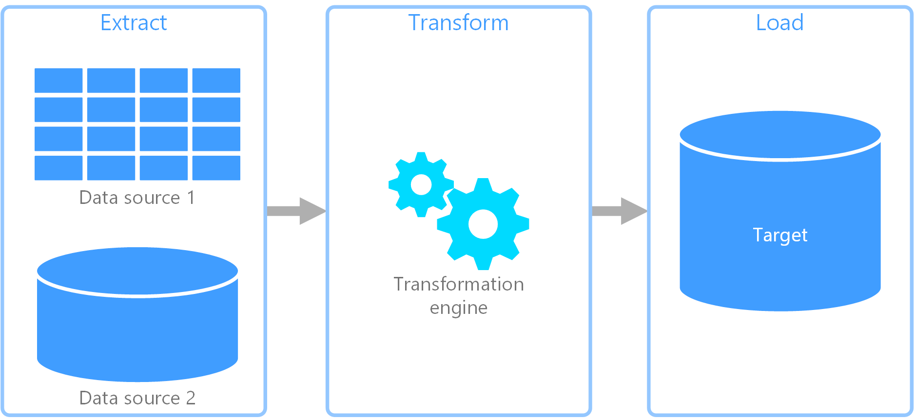
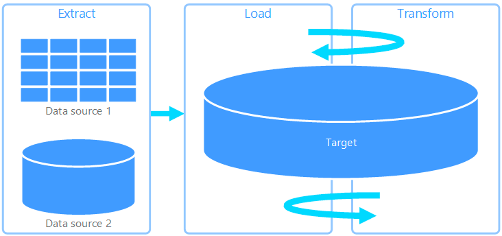
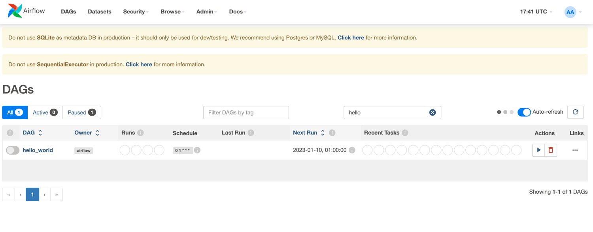
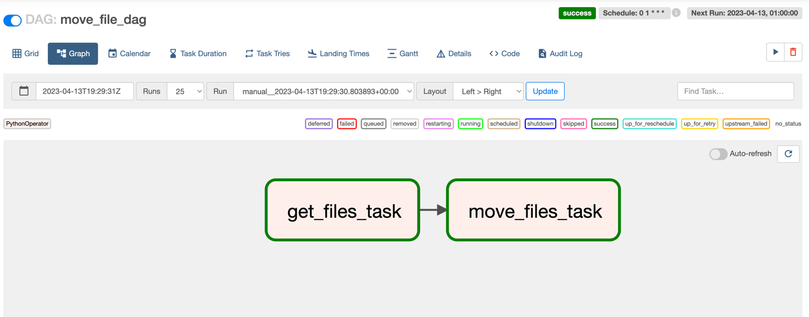
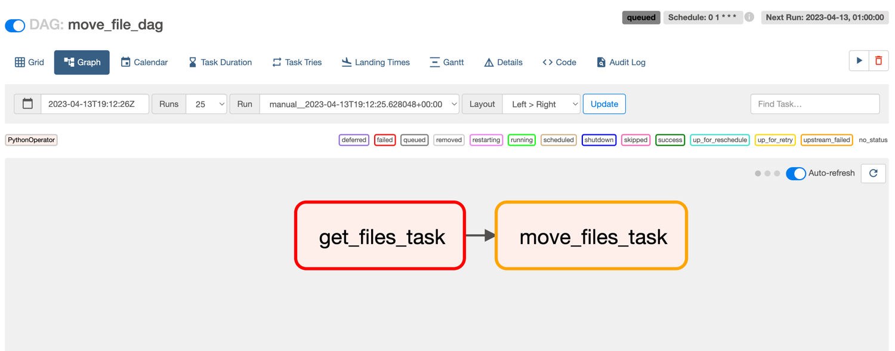
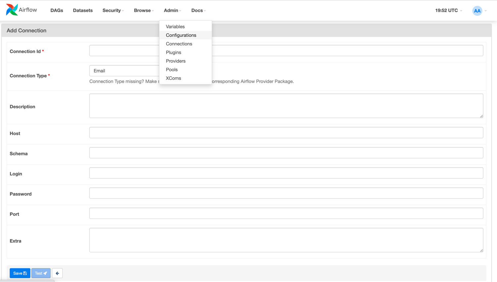

# Airflow

Airflow is an **open-source** platform initially develop by Airbnb to schedule, and orchestrate 
of complex data workflows. It is primarily used in the field of data engineering and data processing to manage the 
movement and transformation of data between systems and processes.


At its core, Airflow provides a workflow automation framework that allows users to define, execute, 
and monitor data pipelines as directed acyclic graphs (DAGs).

!!! info

    You can also use some alternative tool, even if airflow is used in many companies, some of them chose to use 
    similar tool : 
    
    * Prefect
    * Luigi
    * Dagster
    * ...


## What's a dag ? 

DAGs are graphs that represent the dependencies and 
relationships between tasks, where tasks are units of work that perform specific actions on data, 
such as data extraction, transformation, or loading. DAGs in Airflow are defined using Python.


## Why do I need such a tool ?
In the data-world, and especially when you're building an analytics stack you'll perform three main types of operations
* Extract data from sources : it can be API, Databases, files, using scraping technics etc...
* Transform the data : you'll probably clean it, perform some aggregation, consolidate it with other sources
* Load the data : you'll put the data in an appropriate system depending on your needs, for example in a warehouse 
 and plug a bi tool on top of it. You will also use it to expose the data to other systems / applications (ML etc...)


To orchestrate all those operations and implement the logic between them, you'll need some tool : airflow is one of them.


You will meet two main architectural pattern : ETL & ELT. Even if they look very similar, they are not and they have
their own pros and cons
### Recap : Data integration pattern
#### ETL
ETL is the more "traditional" approach, where you prepare your data before loading it to your target system.
It means that the workflow is performed by the transformation engine.



#### ELT
ELT is the more modern approach, the main point here is that you load the data first, and process the data after.
In this case, most the computation is done on the target system directly, which act as the transformation 
engine. This is a common approach used when your core component is a warehouse, like snowflake of bigquery, designed
to handle intensive computation




## How does it work ?!
!!! tip
    
    It's not mandatory to be able to explain how airflow works to use it, however it's a good thing to have a good 
    understanding of the tool you're using...

As a user, you will interact with 3 components : 

* You will configure airflow : writing the `airflow.cfg` file
* You will use the UI :  for managing and monitoring workflows. It allows you to interact with Airflow, 
such as viewing DAGs, triggering DAG runs, monitoring task statuses, and managing connections, variables etc...  
* You will write python DAGs


But there are not the only required components... Here is a brief explanation of the role of each component :

* **Worker**: A worker is a component in the Airflow architecture that is responsible for executing tasks. 
When a task is triggered for execution, it is assigned to a worker, which runs the task and reports the result back 
to the scheduler. Workers can be horizontally scaled to handle a large number of tasks concurrently, 
making them suitable for parallel processing of tasks.


* **Scheduler** The scheduler is the core component of Airflow that manages the scheduling and execution of tasks. 
It determines when tasks should be executed based on their dependencies, triggers, and time-based schedules defined in 
the DAGs (directed acyclic graphs). The scheduler communicates with the metadata database to keep track of task status, 
schedule changes, and other metadata. It also communicates with workers to assign tasks for execution and monitor their 
progress.


> Metadata Database: Airflow uses a SQL database to store metadata about the data pipelines being run.
> In the diagram above, this is represented as Postgres which is extremely popular with Airflow.


> Extract from airflow documentation

## How to deploy airflow ?
There are several way to deploy airflow, the choice will highly depends on your requirements !
!!! warning

    Be careful, some deployments are not suitable for production

### Deploy airflow locally
Here the link to the airflow [documentation](https://airflow.apache.org/docs/apache-airflow/stable/start.html) explaining
how to easily deploy it on your local machine.

!!! info

    You will probably use it for development !

### Using a cloud managed service
Depending on the provider you're working on, you'll use different service with their specificities.
One of the biggest difference will be the way of providing your dag to the service.

#### On AWS
Aws has developed a service called MWAA built on top of airflow, it allows you to not taking care of the management 
of the underlying infrastructure... which can be great when you don't have the resources / knowledges !

The only major difference for a developer is the way of providing your dags, with MWAA you'll need to push them to S3 


> Extract from aws documentation

#### On GCP
Google has developed Cloud composer, also built on top of airflow.

### Deploy airflow on kubernetes (on-premise or in a cloud environment)
!!! info
    
    You can manage a kubernetes cluster ... or use the managed service of your cloud provider.
        

Airflow can be deployed on Kubernetes, a popular container orchestration platform, which provides advanced capabilities
for managing containerized applications at scale. Deploying Airflow on Kubernetes allows for dynamic scaling, 
rolling updates, and self-healing of Airflow components, making it suitable for large-scale and production-grade 
workflows.


## How to create a dag
As previously mentioned, a dag can be written in python... and it's simple !


### Airflow operators
We've seen that a dag is an association of tasks, with dependencies, but what is a task ?
A task can be the execution of a python function, some shell commands, an SQL request etc...

The great thing here is that airflow come with some pre-built `Operators` that you can use in your tasks.

* `BashOperator` - executes a bash command
* `PythonOperator` - calls a Python function
* `PostgresOperator` - To execute an SQL request on a postgres database
* `MySqlOperator` - To execute an SQL request on a mysql database
* ... A lot of operator exists, and allows you to interact with external system easily

<br>

#### Example - A first minimal dag

``` python
from datetime import datetime
from airflow import DAG

from airflow.operators.python import PythonOperator


def print_hello_world():
    return 'Hello world !'


with DAG('hello_world',
         description='Hello world dag',
         schedule_interval='0 1 * * *',
         start_date=datetime(2023, 4, 10)
         ) as dag:
    print_hello_operator = PythonOperator(task_id='hello_task', python_callable=print_hello_world, dag=dag)

    print_hello_operator

```
!!! info

    We can now visualize our dag on the airflow UI. By default, any dag is not activated, we need to switch the left 
    toggle to activate it, and allow the scheduler to trigger it.



We've defined, a dag containing a single task, it's not really useful in the real world.
Let's create an other examples with multiple tasks.


## Example
Assuming we want to create a daily job that move some files from one source directory to a target directory : 

* Let's define a function that list the files in the source
* Implement another function that task as parameter the files from task1 and move the files from the source
to the destination


```python
import os
import shutil
from datetime import datetime
from airflow import DAG

from airflow.operators.python import PythonOperator


def get_files_in_directory(directory_path: str) -> list[str]:
    return os.listdir(directory_path)


def move_files(files_name: list[str], source_directory: str, target_directory: str) -> None:
    for file_name in files_name:
        # Construct source and target file paths
        source_file = os.path.join(source_directory, file_name)
        target_file = os.path.join(target_directory, file_name)

        # Move the file from source to target
        shutil.move(source_file, target_file)


with DAG('move_file_dag', schedule_interval='0 1 * * *', start_date=datetime(2023, 4, 13)) as dag:
    get_files_task = PythonOperator(
        task_id='get_files_task',
        op_args=["./sources"],
        python_callable=get_files_in_directory,
        dag=dag
    )

    move_files_task = PythonOperator(
        task_id='move_files_task',
        python_callable=move_files,
        op_args=[get_files_task.output, "./sources", "./destination"],  # Pass output of get_files_task as argument
        dag=dag
    )

    get_files_task >> move_files_task

```

!!! info

    As you can see, to define the relationship between the two task, we use `>>` operator, you can also wrap multiple
    tasks between square brackets to be dependent on the same upstream task. For example : 
    `first_task >> second_task >> [third_task, fourth_task]`


### Successful dag execution
In case of success, you should have all your tasks in green :




### Failing dag execution
If the first task `get_files_task` fails, the second task `move_files_task` will not be executed (with the default config) 
Here a visual example of this case : 




## Some interesting features
We've seen some very basic features of airflow, it has a lot of other features, that can help you to
build some more complex pipeline.

### Callback

A `Callback` is a function that is only invoked when the task state changes due to execution by a worker.
For example, when a task fails. 

!!!tip 
    
    One good example of callback use is to send some alert when a task fail, it's
    very common to trigger an alert sent by slack or by email to inform that a task has fail.

There are fours type of callback : 


| Name                  | Description                              |
|-----------------------|------------------------------------------|
| on_success_callback   | Invoked when the task succeeds           |
| on_failure_callback   | Invoked when the task fails              |
| sla_miss_callback     | Invoked when a task misses its defined SLA|
| on_retry_callback     | Invoked when the task is up for retry     |


> From airflow documentation


### Connections

Connections are used for storing credentials that are used to connect to external systems such as databases.

A Connection is essentially set of parameters - such as username, password and hostname - 
along with the type of system that it connects to, and a unique name, called the conn_id.

They can be managed via the UI or via the CLI.

Via the UI, you'll need to go to `Admin>>Connections` and will have the following page:



You'll need to install some additional dependencies to use some pre-built connections. For postgresql, you need to 
install the package : `pip install apache-airflow-providers-postgres` 

!!! warning

    After installing a dependency, you'll need to restart your airflow instance

### Hooks

A hook is an interface that allow you to easily communicate with an external system (database for example),
they use the connections to connect to those system. As they encapsulate the details of connecting to and interacting 
with external systems, it helps you to perform some operations with a minimal amount of code.

!!! tip

    If you need to interact with a Postgres database, have a look to the `PostgresHook`

## Cron format reminder
If you have any doubt on your schedule format, check it on [cron-guru](https://crontab.guru/)

!!! info "Cron format"

    ```
    * * * * *
    - - - - -
    | | | | |
    | | | | ----- Day of week (0 - 7) (Sunday is both 0 and 7)
    | | | ------- Month (1 - 12)
    | | --------- Day of month (1 - 31)
    | ----------- Hour (0 - 23)
    ------------- Minute (0 - 59)
    ```

### Example

* To run a command every day at 3:30 AM: `30 3 * * *`
* To run a command every week on Sunday at 8:00 PM: `0 20 * * 0`
* To run a command every month on the 15th at 1:45 PM: `45 13 15 * *`