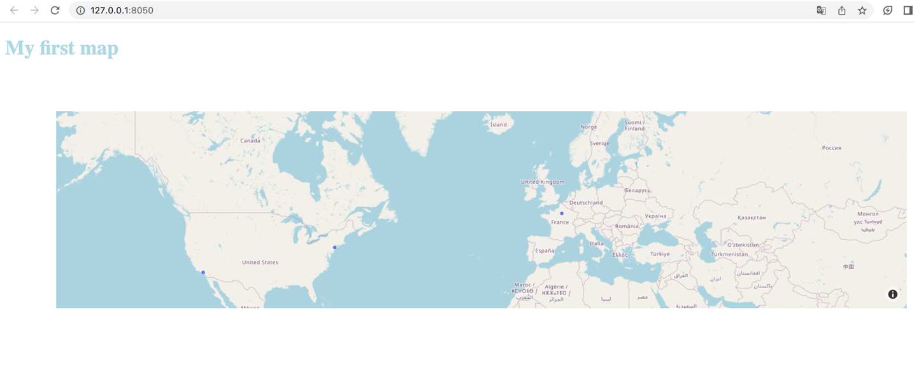

# Data visualization
## Introduction

There are many ways to provide some data visualization : 

* Using some libraries like matplotlib, seaborn or plotly
* Using a BI platform (Tableau, Metabase, PowerBI) ...
* Developing it from scratch 

!!! info

    This is only a subset of examples.

Each solution comes with some pros & cons and the choice will highly depends on your requirements.
For example, matplotlib and seaborn may not be the right choice if you want to expose some interactive dashboard that 
can be rendered in a web-browser and be easily shared. Developing it from scratch can be too much
time-consuming if you don't have advanced skills in web development (which is probably the case if you're a data guy).


One good solution for someone coming from the data field is to use a framework like `Plotly Dash`.
It allows you to create dynamic and interactive web-based application using python code. Also, it 
allows you to manipulate the data using `pandas` which make it a good choice for people from the data field.


## Plotly Dash
Plotly Dash is described by its developers as `The original low-code framework for rapidly building data apps 
in Python.`

The main advantage of this framework is that you don't have to write extensive html, css or javascript.
In addition, it follows a reactive programming paradigm, which basically mean that changes in the user interface
trigger changes in the data, and changes in the data trigger changes in the UI.

Here is an example of what you can build with plotly dash


### Installation
It is very straightforward to install ! Simply run `pip install dash` and you're done.


### How to use it ?
Dash come with a set of components that are ready to use. 

* html components : Instead of writing HTML or using an HTML templating engine, you compose your layout using Python with the 
Dash HTML Components module `dash.html`.
* core components. The Dash Core Components module `dash.dcc` gives you access to many interactive components, 
including graphs, dropdowns, checklists, and sliders.

#### Hello world

```python
from dash import Dash, html

app = Dash(__name__)

app.layout = html.Div(children=[
    html.H1("My first dash application")
])


if __name__ == '__main__':
    app.run_server(debug=True)

```

What really happens is that this code is converted to the following `html`:

```html
<div>
    <h1>My first dash application</h1>
</div>
```


After running the code, you can access your dashboard at [http://127.0.0.1:8050/](http://127.0.0.1:8050/)

!!! info

    You define your application `app = Dash(__name__)` and set its layout as being an html `div`.
    To add some components to your dashboard, you just need to add them as element of the parents.children list.


#### Example with two html components
Let's add an H2 title, we define it as a children of the parent div.
```python
from dash import Dash, html

app = Dash(__name__)

app.layout = html.Div(children=[
    html.H1("My first dash application"),
    html.H2("It's a title2")
])


if __name__ == '__main__':
    app.run_server(debug=True)
```

You can find all the available HTML components on the [following page](https://dash.plotly.com/dash-html-components)

#### Adding some custom style
You can add some custom css style to any components simply by passing to the component, a variable which contains a 
dictionary containing the style properties you want to apply. 
If you want to change the color of the titles :


```python
from dash import Dash, html

app = Dash(__name__)

app.layout = html.Div(children=[
    html.H1("My first dash application", style={'color': '#ADD8E6'}),
    html.H2("It's a title2", style={'color': '#00008B'})
])

if __name__ == '__main__':
    app.run_server(debug=True)

```

You can also use classic css file, you only need to put it in an `assets` directory at the same level as your 
application file

```
- app.py
- assets/
    |-- your_style1.css
    |-- your_style_2.css
```

Instead of passing the ``style`` variable in the previous example, we can add the following file :

```css
h1 {
    color: #ADD8E6
}

h2 {
    color: #00008B
}
```

#### Work with some real data & graphs
!!! tip

    As previously mentioned, plotly allow you to pass it some data from a pandas dataframe, which
    makes really easy to work with csv data.

Assuming we have the following input data (we will create it in the code) : 

| Category | Value |
|----------|-------|
| A        | 10    |
| B        | 20    |
| C        | 15    |
| D        | 5     |


We want to create a barchat which represents the value foreach category. It can be done by adding
a new children `dcc.Graph()` in the parent component. 

There are multiple way to create the figure of the graph : 

* using plotly express api (the most straightforward)
* using list and dict
* using `go.Figure`

Let's do it with plotly express : 

You'll be able to create a barchat, with 2 line of code : 
```python
dcc.Graph(
        id='bar-chart',
        figure=px.bar(df, x='Category', y='Value')
    )
```


The full example : 

```python
import pandas as pd
import plotly.express as px
from dash import Dash, html, dcc

app = Dash(__name__)

# Create a dataframe with fake data (you can use data from a csv or any source instead...)
df = pd.DataFrame({'Category': ['A', 'B', 'C', 'D'],
                   'Value': [10, 20, 15, 5]})

app.layout = (html.Div(children=[
    html.H1("My first graph"),
    dcc.Graph(
        id='bar-chart',
        figure=px.bar(df, x='Category', y='Value')
    )
]))

if __name__ == '__main__':
    app.run_server(debug=True)

```

<br>
If you want to do it with dict and list only :

```python
import pandas as pd
from dash import Dash, html, dcc

app = Dash(__name__)

# Create a dataframe with fake data (you can use data from a csv or any source instead...)
df = pd.DataFrame({'Category': ['A', 'B', 'C', 'D'],
                   'Value': [10, 20, 15, 5]})

app.layout = (html.Div(children=[
    html.H1("My first graph"),
    dcc.Graph(
        id='my_first_barchart',
        figure={
            'data': [{'x': df['Category'], 'y': df['Value'], 'type': 'bar'}],
            'layout': {'title': 'My first barchart!'}
        }
    )
]))

if __name__ == '__main__':
    app.run_server(debug=True)
```

#### Basic callbacks

!!! question "What's a callback ?"

     callbacks are functions that are automatically called by Dash whenever an input component's property changes, 
     in order to update some property in another component (the output).


To achieve filtering (with a dropdown, an input value or whatever), you'll need to define callback to update the graph.
Let's use the same input data (category / value df). We want to be able to filter for specific category, 
to do so, we will add a dropdown filter :

```python
 dcc.Dropdown(
            id='category-filter',
            options=[{'label': category, 'value': category} for category in df['Category']],
            value=None,
            placeholder='Select a category'
        )
```

Now, we want to update our barchart when a category is selected in the dropdown -> Let's implement a callback

!!! info

    What we do here is that we define a fonction that return a figure (our barchart) based on the filtered dataframe.
    The specificity is the `annotator` used to specify which chart are affected (using their id)
    and what's the input (the value of the category-filter)

```python
@app.callback(
    dependencies.Output('bar-chart', 'figure'),
    dependencies.Input('category-filter', 'value')
)
def update_bar_chart(category):
    if category is None:
        # Keep all categories if no value has been selected
        filtered_df = df
    else:
        # Filter the df based on selection
        filtered_df = df[df['Category'] == category]

    return px.bar(filtered_df, x='Category', y='Value')

```
!!! tip

    You can use the same callback to update multiple graphs ! In such a case, you function
    must return as many figure as the number of graphs you want to update


##### Here is the full example

````python

import pandas as pd
import plotly.express as px
from dash import Dash, html, dcc, dependencies

df = pd.DataFrame({'Category': ['A', 'B', 'C', 'D'],
                   'Value': [10, 20, 15, 5]})

app = Dash(__name__)

app.layout = html.Div(
    children=[
        html.H1('My First Dash App'),
        dcc.Dropdown(
            id='category-filter',
            options=[{'label': category, 'value': category} for category in df['Category']],
            value=None,
            placeholder='Select a category'
        ),
        dcc.Graph(
            id='bar-chart',
            figure=px.bar(df, x='Category', y='Value')
        )
    ]
)


# Define callback for updating the bar chart based on the category filter
@app.callback(
    dependencies.Output('bar-chart', 'figure'),
    dependencies.Input('category-filter', 'value')
)
def update_bar_chart(category):
    if category is None:
        # Keep all categories if no value has been selected
        filtered_df = df
    else:
        # Filter the df based on selection
        filtered_df = df[df['Category'] == category]

    return px.bar(filtered_df, x='Category', y='Value')


if __name__ == '__main__':
    app.run_server(debug=True)

````

#### Advanced visualization - Maps
There are a lot of visualization in plotly dash, let's see an example on how can we draw a map
based on some coordinates ! 

You can do it by using `px.scatter_mapbox()` to generate a map figure, you need to specify `lat` & `lon` column name 
and your dataframe. 

!!! tip

    You can apply many different customization, such has changing the style of the map, setting the rendered values
    when hover over a data point etc... Also you can add some filters as we've seen previously, it also works with maps.

> lat & lng need to be valid numerical values


```python

import plotly.express as px
import pandas as pd
from dash import Dash, html, dcc

app = Dash(__name__)

df = pd.DataFrame({'City': ['Paris', 'New York', 'Los Angeles', 'Tokyo'],
                   'Lat': [48.8566, 40.7128, 34.0522, 35.6895],
                   'Lon': [2.3522, -74.0060, -118.2437, 139.6917],
                   'Value': [10, 20, 15, 5]})

app.layout = html.Div(children=[
    html.H1("My first map", style={'color': '#ADD8E6'}),
    dcc.Graph(id="map-graph", figure=px.scatter_mapbox(
        df, 
        lat='Lat',
        lon='Lon',
        hover_name='City',
        zoom=1
    ).update_layout(mapbox_style='open-street-map'))
])

if __name__ == '__main__':
    app.run_server(debug=True)

```
This will render :

