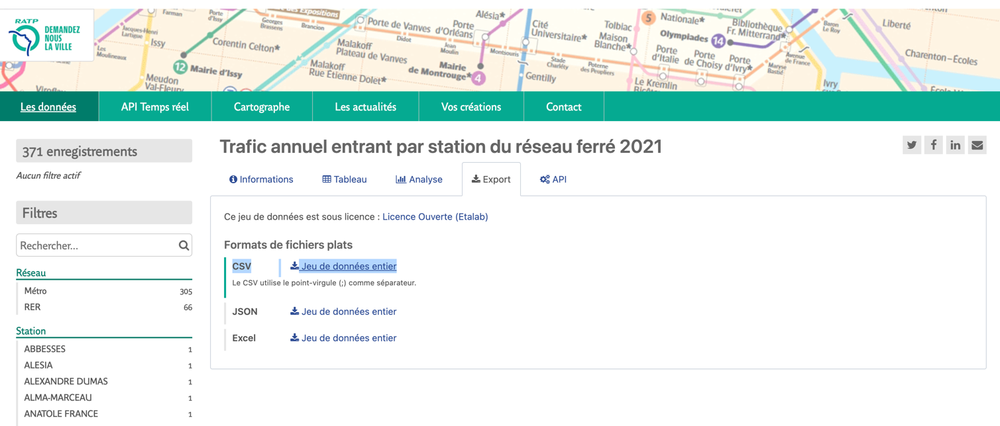
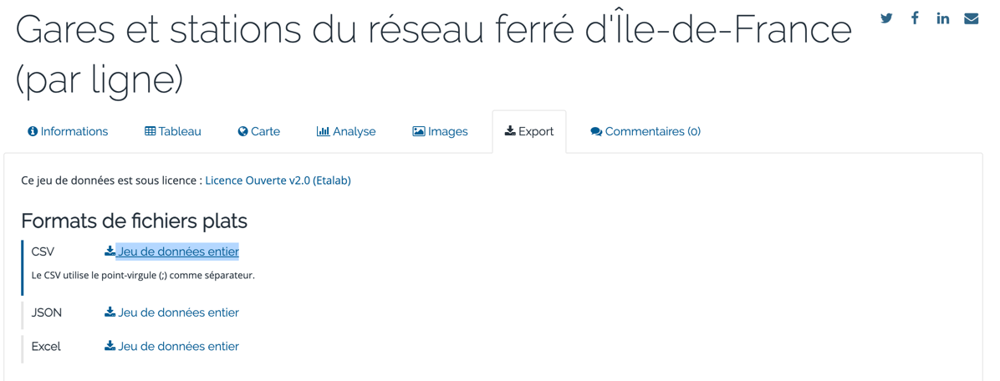

# Data visualization with Plotly Dash

## TP
The goal of the exercise is to :

* Create a web-based dashboard using plotly dash
* Make it ready for distribution with docker
* Manage the code versioning with git (in a good manner)

!!! warning "Grading system"

    Your grade will depends on : 
    
    * The number of steps you've realized. 
    * The quality of your code.
    * How you've used git to version your code.
    * Your ability to use work with data to find some great insights. 
    * Any additional stuff you've implemented to make your dashboard better (style, layout, filtering).


In order to practice git, I advise you to follow a basic `feature-branch` workflow :

* Don't code directly on your main branch
* Create a branch foreach step of the exercise (there are 6 step), merge it into the main and start the next step.

### How to submit your work
!!! danger
    
    You have to submit it before 2023-04-23 23:59

Your work will be submitted as a Github repository (if you choose to make it private, you have to share it with me).

It should have a similar structure to : 

```
your_project/
├─ app.py
├─ requirements.txt
└─ Dockerfile

```

Feel free to add a README.md file to describe your project, explain how to build the docker image, how to run the 
container etc...

### Input data
!!! tip

    Have a look to the data before to deep dive in the exercise

For this exercise, you'll use two input dataset (in csv format), you can download them as follows:

* One from [ratp](https://data.ratp.fr/explore/dataset/trafic-annuel-entrant-par-station-du-reseau-ferre-2021/export/)
This dataset represents all the stations managed by RATP in "Ile de France" (with each transport mode : subway, train etc...) and 
their number of travelers for the year 2021. You also have the city they belong to, and the district.

* 

* One from [ile-de-france-mobilités](https://data.iledefrance-mobilites.fr/explore/dataset/emplacement-des-gares-idf/export/)

This dataset contains all the positions of the stations, this time not only for RATP, but also SNCF etc...

### 1 - Create some graph for RATP dataset
For this question, you need to use the first dataset (the one from RATP). 

#### Objective
* Create a bar chart that represents the `TOP 10` stations with the biggest traffic 
* Create a Pie chart that represents trafic per cities (to make it clear, you can take only the TOP 5)
* Organize those two chart on the same row (they have to be side by side)

### 2 - Create some graph for IDF dataset
For this question, you need to use the first dataset (the one from IDF).
#### Objective
* Create a bar chart that represents the number of stations per `exploitant`
* Create a chart that represents the number of stations per `ligne`

### 3 - Add some global filters
Add some global filter to your dashboard, use some dropdown selection filter.
!!! tip

    Feel free to add any filter, it will help you being more familiar with the concept of `callback`

#### Objective
* One filter for `réseau` (field from the RATP dataset)
* One filter for `exploitant` (field from the IDF dataset)
* 
### 4 - Create an interactive map
!!! info

    For this step, you need to user the second dataset which represents all the subway station in paris, with some 
    geographical informations

In the second dataset, you have many ways to retrieve latitude and longitude, however, you don't have explicit columns
`lat` & `lon` (or anything similar). One way to to it is to split the `geo_point` column :

```python
df[['lat', 'lng']] = df['geo_point'].str.split(',', expand=True)
df['lat'] = df['lat'].str.strip().astype(float)
df['lng'] = df['lng'].str.strip().astype(float)
```
#### Objective
Add a Map to your dashboard to visualize the position of the stations.
### 5 - Containerize your plotly dash application
!!! tip

    Have a look to the docker section, there is an example with a flask application, it's different but the
    logic is very similar

#### Objective
* Create a `Dockerfile` in which you define how the docker image must be build in order to run
your application
* Build your docker image : `docker build -t your_image .`
* Run a container : be careful you need to expose port `8050` which is the port used by plotly dash

In order to make you application accessible from outside the container, you need to set the host to `0.0.0.0`,
you can do it by update the run server : 
````python     
app.run_server(host='0.0.0.0', port=8050, debug=True)
````

### Bonus - Add some style to your dashboard


